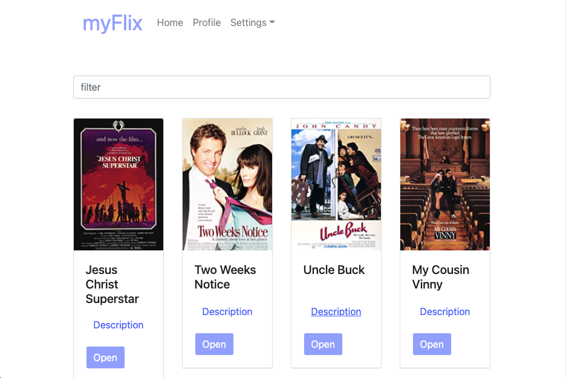

# MyFlix

  

myFlix is a web application where users can create an account, view detailed movie, genre, and director information, and save movies to their list of favorites. It utilizes the myFlix [Movie API](https://github.com/ellenmariestuder/movie_api)-- follow link for API repo and documentation. 

&nbsp; 

# Technologies
This app was built using the MERN stack. Technologies used include:   
* MongoDB
* Express.js
* React
  - React Redux
  - React Bootstrap
* Node.js

&nbsp; 

# Features
## Welcome screen 
  - Registration dialog where new users can create an account
  - Login dialog where existing users can log in

## Movie view
  - Movie cards displaying movie title, image, and a button for adding the movie to user's list of favorites; as well as links to movie genre, director, and description dialogs
    - Genre dialog: displays genre name and description
    - Director dialog: displays director name and bio
    - Synopsis dialog: displays movie description

## User profile view 
  - Displays user data, including username, password, email, and birthday
  - Displays user's favorite movies (including buttons for removing a movie from a user's list of favorites)  
  - Update Info button where users can update their personal data
  - Delete Account button where users can deregister their account 

&nbsp; 

# Deployment

1. Clone this repository; navigate to root directory
 
`git clone https://github.com/ellenmariestuder/myFlix-React.git`

&nbsp; 

2. Install dependencies 
 
`npm install`

&nbsp; 

3. Build for development
 
`parcel src/index.html`

&nbsp; 

4. Run application in browser
`http://localhost:1234/`